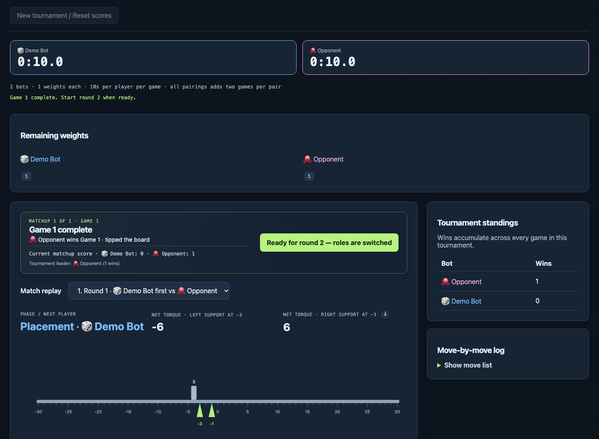
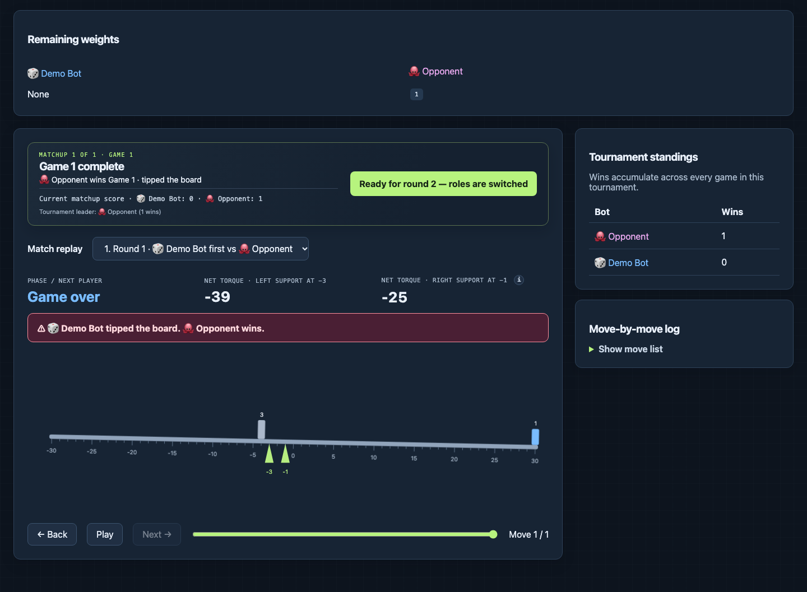

# No Tipping

Tournament runner and replay website for the No Tipping game (as detailed here: https://cs.nyu.edu/courses/fall26/CSCI-GA.2965-001/notipping.html).

Runs on macOS and Linux with Python 3.8+. The runner uses only the Python standard library. The site has been tested locally and on NYU's crunchy5 server.

## Getting started

Build the C and C++ examples before using them. Julia must be installed and available as `julia` to run that example.

```sh
(cd bots/samples/cpp && g++ -std=c++17 -O2 bot.cpp -o bot)
(cd bots/samples/c && gcc -std=c11 -O2 bot.c -o bot)
python3 -m notipping --serve
```

Open [http://127.0.0.1:8000](http://127.0.0.1:8000). The default `bots.json` includes two random Python bots and sample bots written in Python, C++, C, and Julia. Edit that file to change who appears in the tournament. The sample source folders can stay in place when you replace the roster.

### Play a tournament

- Set **Weights per player (k)** to any positive integer and **Clock per player** (default: 120 seconds). The interface accepts values that break the course requirement and displays a red warning when `2k < 50` is not satisfied; it does not prevent you from continuing.
- Choose **All bot pairings** to play every unique bot-versus-bot matchup, or **Choose two bots** to play only the selected pair. Click **Run tournament**; each pairing plays twice, switching who goes first.
- After Game 1, click **Ready for round 2 — roles are switched**. After Game 2, the popup reports the pairing winner or a tie.
- Wins accumulate across every game added to the tournament. Use **New tournament / Reset scores** to start over.

The selected `k` and clock are fixed once a tournament starts. Each player's clock runs only while their bot is responding and carries across all of that player's turns in one game. Results save after each game and restore when the server restarts with the same roster.

Select a game to replay it. Use Play, Back, Next, or the slider; expand **Move-by-move log** to jump to a listed move. A tipping move identifies the player who tipped the board and animates the scale.

### Screenshots

These screenshots use a one-weight demo matchup. The first shows the stable starting board during replay; the second shows the board after a move tips it.





### Run on crunchy5

Copy the project and bot folders to crunchy5. Build C/C++ bots on crunchy5 because local macOS binaries will not run on Linux. Make sure every bot's runtime and dependencies are installed there.

Start the website on crunchy5:

```sh
python3 -m notipping --serve
```

On your laptop, run this command in a second terminal and leave it running while you use the site:

```sh
ssh -J YOUR_USERNAME@access.cims.nyu.edu \
  -L 8000:localhost:8000 \
  YOUR_USERNAME@crunchy5.cims.nyu.edu
```

With the SSH connection open, visit **http://localhost:8000** in your laptop's browser. The server listens only on crunchy5's localhost; use `--port` and the matching forwarded port if 8000 is taken.

## Make a bot

### 1. Create a folder

Put your complete project in a folder under `bots/`, for example `bots/shela-bot/`. Include all source files, data, and resources it needs. Multiple files are fine. There is no bot file-size or file-count limit in this runner. Include the language/runtime version and any build or setup steps; compile C/C++ on the machine where the competition will run.

### 2. Read the state and print one move

The runner starts your bot on its first turn and keeps that process running for the rest of the game. Read one JSON object per line from standard input; for each line, print exactly one JSON move on its own line to standard output and flush it. Keep reading until the runner closes standard input at the end of the game. Send diagnostics to standard error. **In-memory variables persist between your turns in the same game**, just as they do in a turn-by-turn client. They reset for the next game, which starts a new process. Each input includes the latest full game state, so use that as your source of truth; persistent variables are optional strategy memory.

During placement (`phase` is `add`), return an available weight and position:

```json
{"position":-3,"weight":2}
```

During removal (`phase` is `remove`), return an occupied position:

```json
{"position":-4}
```

The input includes `k`, `phase`, `player`, `players`, the board, remaining weights, torque totals, clocks, and a game ID. Positions range from -30 through 30. `player` is the current player's index in `players`; your bot may play first or second. The `remaining` and `clocks` arrays use that same player order. Each board item has a position, weight, and owner (`null` for the initial block); clocks show seconds remaining at the start of the turn.

Example input on the first turn with `k=2`:

```json
{"protocol_version":1,"k":2,"phase":"add","player":0,"board":[{"position":-4,"weight":3,"owner":null}],"remaining":[[1,2],[1,2]],"torques":{"left":-6,"right":6},"clocks":[120,120],"winner":null,"reason":null,"game_id":"1","ply":1,"players":["Alice","Bob"]}
```

Any command-line program that reads and writes this JSON protocol can be used. The examples cover Python, C, C++, and Julia; other languages work if their runtime is installed on the machine running the tournament. The runner launches commands directly, without a shell, with the bot folder as its working directory. `{python}` uses the runner's Python interpreter.

### 3. Add it to the roster

Add one entry to `bots.json`. The `cwd` path is relative to `bots.json`. For example:

```json
{"name":"Shela's Bot","cwd":"bots/shela-bot","command":["{python}","main.py"]}
```

For compiled or other-language bots, set `command` to the executable and arguments needed to start your bot. The runner does not compile code or install packages. Avoid requiring internet access. The interface assigns each bot a random emoji and color.

### 4. Test and hand it off

Test your bot on both an `add` state and a `remove` state. Confirm it prints one valid move and no other text to standard output. Send the complete bot folder by **Wednesday, October 7th**, with its name, runtime version, and build/setup commands. Include a short README if setup takes more than one step.

The bundled random bot in `bots/random/` uses multiple Python files. The language examples are in `bots/samples/`. To test them, list them in `bots.json`; build the C/C++ examples as shown in **Getting started** and install Julia if you want to run that example.

## Rules and limits

- Each player has one weight of every size from 1 to `k`. The course requires `2k < 50` (so `k` must be at most 24). The interface accepts any positive integer `k`; if `k` is 25 or greater, it displays a red warning that the course requirement is not met, but still lets you continue. The board has 60 open positions, so values above `k=30` cannot fit all players' weights during placement.
- The board is at position 0 and weighs 3 kg. Supports are at -3 and -1. The initial 3 kg block is at -4. Each position can hold at most one block; both support positions can hold weights.
- Players alternate placing weights until both players have placed all of theirs. Only then does player 0 start removing blocks. Either player may remove any placed block, including the opponent's or the initial block. The board itself cannot be removed. In other words, you cannot remove any block while placement is still underway.
- Torque about support `s` is `-3*(0-s) - sum(weight*(position-s))`. This is the one-dimensional lever-arm form of the standard torque equation, `τ = r × F`, summed over the board and blocks; the game omits the shared gravitational acceleration factor and uses clockwise-negative signs. [OpenStax University Physics explains torque and the lever arm](https://openstax.org/books/university-physics-volume-1/pages/10-6-torque). Stability requires left torque `<= 0` and right torque `>= 0`; zero is stable. A move that tips the board loses immediately.
- Each player gets 120 seconds per game by default. Bot startup and strategy execution count against that player's clock. The browser and command line can change the clock.
- Standard output and standard error are each limited to **65,536 bytes per move**. This is an output limit, not a source-file limit. Invalid JSON or moves, launch failures, nonzero exits, excess output, and timeout forfeit the game.
- There is no application-enforced CPU or memory quota beyond the clock. Bots run with the organizer account's filesystem and network permissions; this is not a security sandbox. Submit code you trust, and keep file access within your bot folder. Processes are stopped after each move.

## Run without the website

```sh
python3 -m notipping --bots bots.json --k 15 --clock 120 --output results.json
```

Each unordered bot pair plays twice, swapping who goes first. A win earns one point; the two-game pairing may end tied. The output JSON saves every game. Starting a new browser tournament resets the previous scores; completed results are saved as each game finishes.

## Tests

```sh
python3 -m unittest discover -s tests -v
```

The Julia sample test is skipped if Julia is not installed.
